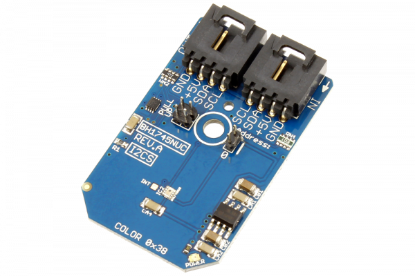

# BH1745NUC

ROHM Semiconductor’s BH1745NUC is a 16-bit I2C digital color sensor that detects RGB (Red, Green, Blue) components and converts them into digital values. High sensitivity, wide detection range (0.005 to 40k lx), and excellent IR cut characteristics make it easy to accurately obtain the color temperature and brightness of ambient light.
This Device is available from www.ncd.io 

[SKU: BH1745NUC_I2CS]

(https://store.ncd.io/product/bh1745nuc-digital-ambient-light-and-color-sensor-i2c-mini-module/)
This Sample code can be used with Arduino.

Hardware needed to interface BH1745NUC sensor with Arduino

1. <a href="https://store.ncd.io/product/i2c-shield-for-arduino-nano/">Arduino Nano</a>

2. <a href="https://store.ncd.io/product/i2c-shield-for-arduino-micro-with-i2c-expansion-port/">Arduino Micro</a>

3. <a href="https://store.ncd.io/product/i2c-shield-for-arduino-uno/">Arduino uno</a>

4. <a href="https://store.ncd.io/product/dual-i2c-shield-for-arduino-due-with-modular-communications-interface/">Arduino Due</a>

5. <a href="https://store.ncd.io/product/bh1745nuc-digital-ambient-light-and-color-sensor-i2c-mini-module/">BH1745NUC Ambient Light and Color Sensor</a>

6. <a href="https://store.ncd.io/product/i%C2%B2c-cable/">I2C Cable</a>

BH1745NUC:

ROHM Semiconductor’s BH1745NUC is a 16-bit I2C digital color sensor that detects RGB (Red, Green, Blue) components and converts them into digital values. High sensitivity, wide detection range (0.005 to 40k lx), and excellent IR cut characteristics make it easy to accurately obtain the color temperature and brightness of ambient light.

Applications:

•LCD TV, Mobile phone, NOTE PC, Tablet PC, Portable game machine, Digital camera, Digital video camera,PDA, LCD display.

How to Use the BH1745NUC Arduino Library
The BH1745NUC has a number of settings, which can be configured based on user requirements.The following commands sets the values in the registers as given in <a href="http://www.rohm.com/web/global/datasheet/BH1745NUC/bh1745nuc-e">BH1745NUC datasheet</a>.

1.Intial reset:The following command is used to set the initial reset bit as not started.

            Bit       TYPE          Description
             7         RW         0 : initial reset is not started
                                  1 : initial reset is started
        
           bh.setSWReset(SW_RESET_NOT_START);                  // Initial reset is not started
           
 2.Measurement time:The following command is used to set the measurement time bit as 160 msec.
 
           bh.setMeasTime(MEAS_TIME_160);                      // 000 : 160 msec
           
 3.Valid:The following command is used to set the valid bit that RGBC data is updatad after last writing MODE_CONTROL1,2,3 register or last reading MODE_CONTROL2 register
 
           bh.setRGBCValid(RGBC_VALID_UPDATE);                 // RGBC data is updated after last writing MODE_CONTROL1,2 register or last reading MODE_CONTROL2 register

4.RGBC_EN:The following command is used to set the RGBC_EN bit that RGBC measurement is active.
 
           bh.setRGBCEnable(RGBC_EN_ACTIVE);                   // RGBC measurement is activebh.setRGBCEnable(RGBC_EN_ACTIVE);                   // RGBC measurement is active

5.ADC GAIN:The following command is used to set the gain of RGBC measurement as 1X.

           bh.setADCGain(ADC_GAIN_1X);                         // 00 : 1X

6.INT STATUS:The following command is used to set the INT STATUS of RGBC.

           bh.setINTStatus(STATUS_INACTIVE);                   // Interrupt signal is inactive
 
7.INT LATCH:The following command is used to set the INTERRUPT pin as latched until INTERRUPT register is read or initialized
    
            bh.setINTLatch(INT_LATCH_LATCHED);                  // INTERRUPT pin is latched until INTERRUPT register is read or initialized

8.INT ENABLE:The following command is used to set the INTERRUPT pin as disable.

            bh.setINTEnable(INT_ENABLE_DISABLE);                // INTERRUPT pin disable
            
9.PERSISTENCE:The following command is used to set the PERSISTENCE bit as Interrupt status is updated at each measurement end.

           bh.setPersistance(PERSISTENCE_UPDATED_EACH);        // Interrupt status is updated at each measurement end

